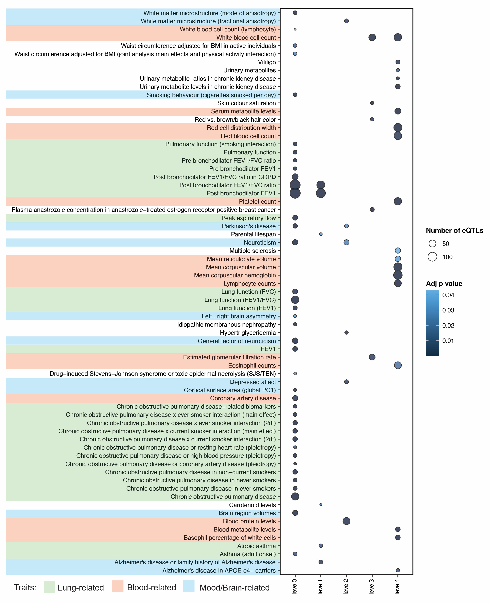

# De novo discovery of traits co-occurring with chronic obstructive pulmonary disease.

This repository contains scripts, data, results, figures and reproducibility report for "De novo discovery of traits co-occurring with chronic obstructive pulmonary disease" study. In this study, we have integrated information across different biological levels (i.e. genetic variants, lung-specific 3D genome structure, gene expression and protein-protein interactions) to build lung-specific gene regulatory and protein-protein interaction networks. We have queried these networks using disease-associated SNPs for chronic obstructive pulmonary disease (COPD), unipolar depression (UD) and coronary artery disease (CAD).

Python (version 3.6.9), R (version 4.0.2) and RStudio (version 1.2.5033) were used for data processing, analysis and visualisation.

1. Hi-C datasets for primary lung cells are available on [GEO](https://www.ncbi.nlm.nih.gov/geo/) (accession numbers: GSM2322544, GSM2322545).
2. Total RNA-seq and WGS datasets across GTEx v8 lung tissue are available via the [dbGaP](https://www.ncbi.nlm.nih.gov/gap/) (accession: phs000424.v8.p2).  
3. Human genome build hg38 release 75 (GRCh38) (Homo_sapiens_assembly38_noALT_noHLA_noDecoy.fasta) was downloaded from [gs://gtex-resources](https://console.cloud.google.com/storage/browser/gtex-resources/references).
4. SNP genomic positions for genome GRCh38p7 build 151 were obtained from ftp://ftp.ncbi.nih.gov/snp/organisms/human_9606_b151_GRCh38p7.  
5. Gene annotation for GENCODE v26 (gencode.v26.GRCh38.genes.gtf) was downloaded from [gs://gtex-resources](https://console.cloud.google.com/storage/browser/gtex-resources/references).  
6. SNPs associated with COPD were downloaded from the [GWAS Catalog](www.ebi.ac.uk/gwas/) on 09/06/2021.
7. SNPs associated with CAD were downloaded from the [GWAS Catalog](www.ebi.ac.uk/gwas/) on 11/04/2022.
8. SNPs associated with UD were downloaded from the [GWAS Catalog](www.ebi.ac.uk/gwas/) on 11/04/2022.
9. [GWAS Catalog](https://www.ebi.ac.uk/gwas/docs/file-downloads) was queried for SNP-trait associations on 22/11/2021.  
10. [STRING PPI database](https://string-db.org/) (version 11.0) was queried on 22/11/2021.

We identified 39 GWAS traits that are enriched (FDR ≤ 0.05) for eQTLs associated with COPD-eQTL target genes (level 0). Most of these co-occuring traits are “lung-related” (i.e. COPD, lung function, pulmonary function, post bronchodilator FEV1, asthma) and “mood/brain-related” (i.e. brain region volumes, cortical surface area, depressed affect, neuroticism, Parkinson’s disease, white matter microstructure, smoking behaviour). Genes interacting with COPD-associated genes (level 1) within LSPPIN are regulated by eQTLs that have previously been associated with Alzheimer’s disease, atopic asthma and post bronchodilator FEV1 or FEV1/FVC ratio. Level 2-genes are only regulated by eQTLs previously associated with “mood/brain-related” (e.g. depressed affect, neuroticism, Parkinson’s disease) or “blood-related” (e.g. blood protein levels) traits. Genes within levels 3 and 4 are mostly associated with eQTLs enriched within “blood-related” traits.
